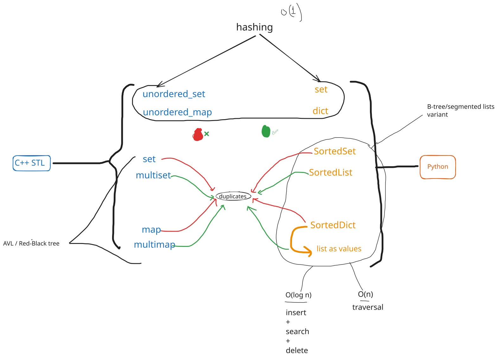

See:
+ Removing element see below
+ irange and islice , see below

## 📑 PKM Note: Sorted Containers (C++ STL vs. Python) & DSA Theory

## 🧠 1. Theoretical Foundations (DSA Core)

In pure computer science theory, ordered associative structures are built using Self-Balancing Binary Search Trees (BSTs) or Multiway Trees.

- Standard Containers (No Duplicates): Enforce strict uniqueness.
    
    - Set: A tree where the value itself acts as the key.
    - Map / Dictionary: A tree where nodes store Key-Value pairs. The tree balances and searches strictly based on the _Key_; the _Value_ is satellite data.
    
- Multi-Containers (Allows Duplicates): Allow multiple identical keys to coexist.
- The Balancing Act: Traditional BSTs can degrade to O(n) if keys are added in sorted order. Self-balancing mechanisms (Red-Black, AVL) enforce strict rotation rules to guarantee a tree height of $O(\log n)$.

---

## ⚔️ 2. Architectural Comparison: C++ vs. Python

While they share the exact same theoretical time complexities, C++ and Python implement these containers using fundamentally different memory architectures.

|Feature|C++ STL (`std::set` / `std::map`)|Python `sortedcontainers` (`SortedSet` / `SortedDict` / `SortedList`)|
|---|---|---|
|Underlying Engine|Red-Black Tree (Node-Based)|B-Tree Variant (Segmented "List of Lists")|
|Node Capacity|Exactly 1 element per node.|Up to ~2,000 elements grouped inside a C-optimized sublist.|
|Memory Structure|Scattered across heap memory using pointers (`left`, `right`, `parent`).|Packaged contiguously in physical blocks of memory.|
|Cache Efficiency|Poor (High pointer chasing causes CPU cache misses).|Excellent (Contiguous arrays utilize modern CPU hardware caching).|
|Memory Overhead|High (Overhead for multiple pointers per element).|Low (Leverages standard flat C-arrays under the hood).|

---

## 📊 3. The 3 Python Sorted Containers

Since Python's built-in `set` and `dict` are strictly Hash Tables (O(1) average, unsorted), the external `sortedcontainers` library fills the gap:

## 📥 `SortedSet`

- Analogue: C++ `std::set`.
- Behavior: Automatically sorts unique elements in ascending order. No duplicates allowed.

## 🗺️ `SortedDict`

- Analogue: C++ `std::map`.
- Behavior: Keeps key-value pairs sorted strictly by their keys. Keys must be unique.
- 💡 Multimap Workaround: To replicate a C++ `std::multimap` (duplicate keys), map your keys to a list of values: `SortedDict(defaultdict(list))`.

## 📜 `SortedList`

- Analogue: C++ `std::multiset`.
- Behavior: Maintains elements in sorted order but allows duplicate elements.

---

## ⏱️ 4. Operational Complexities & Error Matrix

Unlike standard Python arrays where index 0 operations (like `pop(0)`) shift the entire array in O(n) time, sorted containers restrict shifts to small, localized sublist blocks, achieving $O(\log n)$ efficiency.

## 📋 Complexity Cheat Sheet

- Search / Find: $O(\log n)$
- Insertion: $O(\log n)$
- Deletion: $O(\log n)$
- Index Pop (`pop(0)` or `pop(-1)`): $O(\log n)$
- Full Traversal: O(n)
- Range Traversal (`.irange(low, high)`): $O(\log n + m)$ _(where m is the count of items in that range)_

## 💥 Error Handling Reference Matrix

|Container|Operation|Syntax|Behavior if Empty|Behavior if Key/Index Missing|
|---|---|---|---|---|
|`SortedList`|Removal|`sl.remove(val)`|💥 Throws `ValueError`|💥 Throws `ValueError`|
||Pop|`sl.pop(idx)`|💥 Throws `IndexError`|💥 Throws `IndexError`|
|`SortedSet`|Strict Removal|`ss.remove(val)`|💥 Throws `KeyError`|💥 Throws `KeyError`|
||Safe Removal|`ss.discard(val)`|✅ Safe (Does nothing)|✅ Safe (Does nothing)|
||Pop|`ss.pop(idx)`|💥 Throws `IndexError`|💥 Throws `IndexError`|
|`SortedDict`|Removal|`del sd[key]`|💥 Throws `KeyError`|💥 Throws `KeyError`|
||Strict Pop|`sd.pop(key)`|💥 Throws `KeyError`|💥 Throws `KeyError` _(unless default fallback given)_|
||Index Pop|`sd.popitem(idx)`|💥 Throws `IndexError`|💥 Throws `IndexError`|

---

## 🗣️ 5. Interview Phrasing Scripts

## Script A: Explaining Python's Sorted Architecture

> _"Python lacks built-in self-balancing trees, so we use the `sortedcontainers` library. Structurally, `SortedSet` and `SortedDict` are not traditional Red-Black or AVL trees. Instead, they use a highly optimized B-Tree variant (a segmented 'List of Lists') to eliminate node pointer overhead. However, mathematically they fulfill the exact same DSA boundaries: maintaining strict sort order with $O(\log n)$ search, insert, and delete guarantees."_

## Script B: Defending `SortedList` over Python's built-in `list`

> _"I am deliberately using `SortedList` over a standard list here because I need to make regular positional extractions like `pop(0)`. In a standard Python dynamic array, `pop(0)` triggers a linear O(n) element shift. In `SortedList`, the internal segmented structure confines the shift to a small localized memory block, bringing the execution time down to an efficient $O(\log n)$."_

---

# Removals in sorted containers

==================================================================
        QUICK REFERENCE: REMOVALS IN SORTEDCONTAINERS
==================================================================

1. SortedList & SortedSet (Sequence / Set Operations)
------------------------------------------------------------------
• By Value (Safe):       container.discard(val)  <- No error if missing
• By Value (Unsafe):     container.remove(val)   <- KeyError/ValueError if missing
• By Index:              container.pop(idx)      <- Removes & returns item
                         del container[idx]      <- Deletes item directly

2. SortedDict (Key / Value Mapping)
------------------------------------------------------------------
• By Key (Safe):         sd.pop(key, None)       <- Behaves like .discard()
• By Key (Unsafe):       sd.pop(key)             <- KeyError if missing
                         del sd[key]             <- KeyError if missing

• By Index (Position):   sd.popitem(idx)         <- Removes & returns (key, val)
                         del sd.iloc[idx]        <- Deletes pair at index

• By Value:              Must search for the key first:
                         key = next((k for k, v in sd.items() if v == target), None)
                         if key: sd.pop(key)
==================================================================

---

# irange() and islice()
==================================================================
        QUICK REFERENCE: irange() vs islice() & SAFE USAGE
==================================================================

1. The Core Difference
------------------------------------------------------------------
• irange(low, high)  <- Search by VALUE / KEY boundaries.
                        Example: numbers between 50 and 100.
                        Runs in O(log N) to find the start.

• islice(start, stop) <- Search by INDEX position.
                        Example: elements from index 0 to 5.
                        Runs in O(log N) to find the start.

*Note: Both return lightweight ITERATORS, not copies of the data.

2. Golden Rule of Modification: "Materialize Before Modifying"
------------------------------------------------------------------
❌ NEVER delete elements directly inside an irange or islice loop. 
   Modifying the container while iterating over its live data will 
   corrupt the iterator and cause errors or skipped elements.

   BAD CODE (Will crash or skip items)
   for item in ss.irange(10, 20):
       ss.remove(item)

  GOOD CODE (Materialize to a list first)
   to_remove = list(ss.irange(10, 20))
   for item in to_remove:
       ss.remove(item)

3. Inclusive vs. Exclusive Boundaries (irange specific)
------------------------------------------------------------------
By default, irange is inclusive on both sides. Use the `inclusive` 
parameter tuple (low_bool, high_bool) to change this behavior:

• ss.irange(10, 20, inclusive=(True, True))   <- [10, 20] (Default)
• ss.irange(10, 20, inclusive=(False, True))  <- (10, 20] 
• ss.irange(10, 20, inclusive=(True, False))  <- [10, 20)

==================================================================
