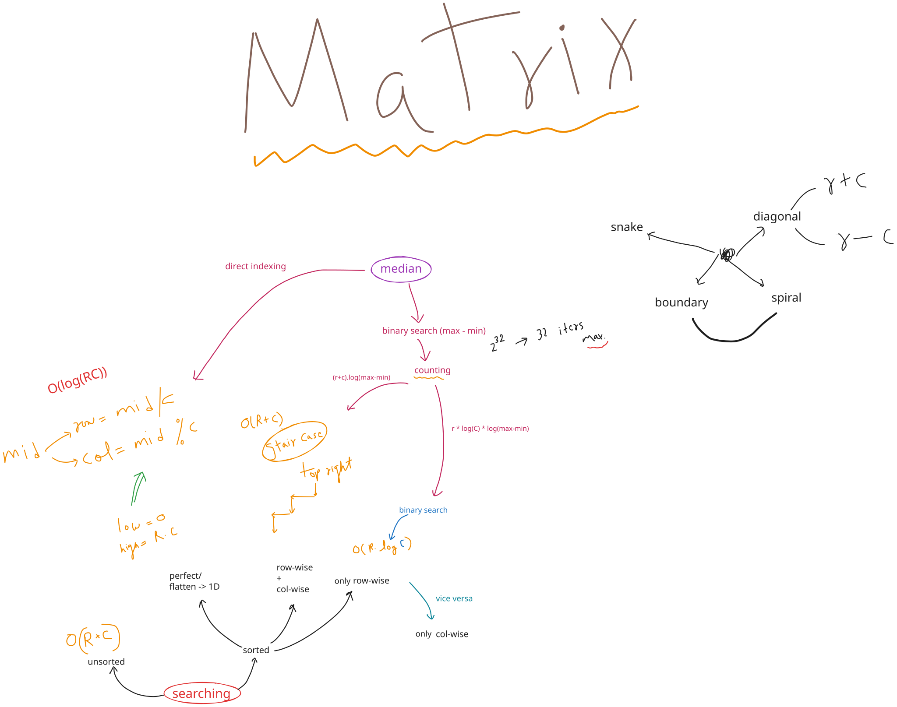

## 🧠 Mind map




---
See Also
+ [spiral-traversal-of-a-matrix](../Problems/spiral-traversal-of-a-matrix.md)
+ [transpose-of-a-matrix](../Problems/transpose-of-a-matrix.md)
+ [median-in-a-row-wise-sorted-matrix](../Problems/median-in-a-row-wise-sorted-matrix.md)
+ [rotate-matrix-by-90°-anti-clockwise](../Problems/rotate-matrix-by-90°-anti-clockwise.md)
+ Checkout fast pythonic tricks below

# Initialization Quirk

In Python, multiplying a list containing a list by an integer (e.g., `[[0] * 3] * 3`) creates shallow copies of the inner list, meaning every row points to the exact same object in memory.

When you modify one element, all rows change simultaneously because they are duplicates of the same reference.

## The Bug Example

```python
# Intended: Create a 3x3 matrix of zeros
matrix = [[0] * 3] * 3

# Modify the top-left element
matrix[0][0] = 5

print(matrix)
# Output: [[5, 0, 0], [5, 0, 0], [5, 0, 0]]
```

## Why It Happens

1. `[0] * 3` successfully creates a single list: `[0, 0, 0]`.
2. `[ [...] ] * 3` takes the reference to that _one specific list_ and copies the reference three times.
3. The outer list now holds three pointers all looking at the same memory address.

## The Correct Fix

Use a list comprehension instead. This evaluates the inner list expression on every iteration, creating a brand-new, independent list object for each row.

```python
# Correct way: Creates 3 distinct row objects
matrix = [[0] * 3 for _ in range(3)]

matrix[0][0] = 5

print(matrix)
# Output: [[5, 0, 0], [0, 0, 0], [0, 0, 0]]
```


---
# Matrix Traversal Patterns

All four patterns exploit **index arithmetic** instead of extra bookkeeping — that's the unifying idea worth remembering, not the code itself. Once you see a matrix problem, ask: _does direction depend on row parity (snake), on shrinking bounds (boundary), or on a fixed `r-c`/`r+c` (diagonals)?_

---

## 1. Snake (Boustrophedon) Traversal

**Idea:** row by row, but flip direction every alternate row instead of always resetting to column 0. This is why it's called "snake" — it slithers back and forth instead of jumping.

**Why it matters:** any time you're told "no backtracking / minimize cursor movement" or asked to print a matrix in a zigzag, this is the pattern. It's the array-2D analog of doing a boustrophedon scan (literally "as the ox plows").

```
Matrix:                Traversal order:
1  2  3  4              1 → 2 → 3 → 4
5  6  7  8               ↓
9 10 11 12               8 ← 7 ← 6 ← 5
                                    ↓
                          9 → 10 → 11 → 12
```

```python
def snake_traversal(matrix):
    result = []
    for i, row in enumerate(matrix):
        result.extend(row if i % 2 == 0 else row[::-1])
    return result
```

The only decision point is `i % 2` — even rows go left→right, odd rows go right→left. No pointers, no extra state.

---

## 2. Boundary Traversal (4-pointer: top / bottom / left / right)

**Idea:** instead of thinking in terms of rows and columns, think in terms of **four shrinking boundaries**. This reframing is what makes spiral traversal (the layered version) a natural extension later — boundary traversal is the single-layer special case.

**Why 4 pointers instead of nested loops:** nested loops force you to special-case "don't double print corners." Pointers `top, bottom, left, right` let each side print exactly the range it owns, and you guard with `if top != bottom` / `if left != right` so a single row or column doesn't get printed twice.

```
top=0 ─────────────────►
      1   2   3   4
left  5   6   7   8   right
      9  10  11  12
bottom=2 ────────────────►

Boundary order: 1,2,3,4 (top row) → 8,12 (right col) →
                11,10,9 (bottom row, reversed) → 5 (left col, reversed)
```

```python
def boundary_traversal(matrix):
    if not matrix:
        return []
    top, bottom = 0, len(matrix) - 1
    left, right = 0, len(matrix[0]) - 1
    result = []

    # top row
    for c in range(left, right + 1):
        result.append(matrix[top][c])
    # right column
    for r in range(top + 1, bottom + 1):
        result.append(matrix[r][right])
    # bottom row (only if it's a different row than top)
    if top != bottom:
        for c in range(right - 1, left - 1, -1):
            result.append(matrix[bottom][c])
    # left column (only if it's a different column than right)
    if left != right:
        for r in range(bottom - 1, top, -1):
            result.append(matrix[r][left])

    return result
```

The `top != bottom` / `left != right` guards are the whole trick — they're what stop a 1×N or Nx1 matrix from double-counting its only row/column.

---

## 3. Diagonal Traversal (`r - c` is constant)

**Idea:** every cell on the same **top-left → bottom-right** diagonal (the `\` direction) shares the same value of `row - col`. That's the entire insight — once you see it, grouping becomes a dictionary/bucket keyed by `r - c`.

```
Matrix (r-c labeled):
r-c:  0   1   2
     -1   0   1
     -2  -1   0

1  2  3          Diagonal (r-c=0): 1, 6, 11
5  6  7          Diagonal (r-c=1): 2, 7
9 10 11          Diagonal (r-c=-1): 5, 10
```

`r - c` ranges from `-(cols-1)` to `(rows-1)`, so you can offset it by `cols - 1` to use as a non-negative array index instead of a dict.

```python
from collections import defaultdict

def diagonal_traversal(matrix):
    rows, cols = len(matrix), len(matrix[0])
    diagonals = defaultdict(list)
    for r in range(rows):
        for c in range(cols):
            diagonals[r - c].append(matrix[r][c])
    return diagonals  # keyed by r-c, each list is one \ diagonal top-left to bottom-right
```

**Why this generalizes:** any "group cells that lie on the same falling diagonal" problem (matrix rotation, diagonal sum, Toeplitz matrix check) reduces to this one bucket key. Toeplitz check in particular is _directly_ this: a Toeplitz matrix is one where every `r-c` bucket has all equal values.

---

## 4. Anti-Diagonal Traversal (`r + c` is constant)

**Idea:** the mirror of #3 — cells on the same **bottom-left → top-right** diagonal (the `/` direction) share the same `row + col`. `r + c` ranges from `0` to `(rows-1)+(cols-1)`, which directly tells you how many anti-diagonals exist: `rows + cols - 1`.

```
Matrix (r+c labeled):
r+c:  0   1   2
      1   2   3
      2   3   4

1  2  3          Anti-diagonal (r+c=0): 1
5  6  7          Anti-diagonal (r+c=2): 3, 6, 9   <- the "middle" longest one
9 10 11          Anti-diagonal (r+c=4): 11
```

```python
from collections import defaultdict

def anti_diagonal_traversal(matrix):
    rows, cols = len(matrix), len(matrix[0])
    anti_diagonals = defaultdict(list)
    for r in range(rows):
        for c in range(cols):
            anti_diagonals[r + c].append(matrix[r][c])
    return anti_diagonals  # keyed by r+c, each list is one / diagonal
```

**This is the engine behind LeetCode's "Diagonal Traverse" (zigzag print):** group by `r + c`, then alternate the direction you read each bucket — even `r+c` buckets reversed, odd buckets as-is (or vice versa, depending on which corner you start from). The zigzag on top of anti-diagonal grouping is structurally identical to snake traversal's `i % 2` flip — same idea, applied to diagonal index instead of row index.

```python
def diagonal_traverse_zigzag(matrix):
    if not matrix:
        return []
    rows, cols = len(matrix), len(matrix[0])
    buckets = defaultdict(list)
    for r in range(rows):
        for c in range(cols):
            buckets[r + c].append(matrix[r][c])

    result = []
    for k in range(rows + cols - 1):
        diag = buckets[k]
        result.extend(diag if k % 2 == 0 else diag[::-1])
    return result
```

---

## Quick recall table

|Pattern|Grouping / control key|Direction flip|
|---|---|---|
|Snake|row index `i`|`i % 2`|
|Boundary|4 shrinking pointers|fixed order, guarded by `top!=bottom`, `left!=right`|
|Diagonal (`\`)|`r - c` constant|none — just bucket|
|Anti-diagonal (`/`)|`r + c` constant|`k % 2` when zigzagging (LeetCode variant)|

The pairing to keep in your head: **snake and zigzag anti-diagonal are the same trick** (alternate by parity of an index), just applied to different keys (row vs. diagonal number).


---

# Pythonic Matrix Operations (zip/comprehension tricks)

Core idea behind almost all of these: `zip(*matrix)` unpacks rows as separate args and zips them column-wise — that alone gives you transpose, and everything else composes with a reverse.

### Transpose

```python
transposed = [list(row) for row in zip(*matrix)]
```

`*matrix` unpacks each row as a positional arg → `zip` pairs up i-th elements across rows → i-th column. **O(rc) time, O(rc) space.**

### Rotate 90° CW

```python
rotated = [list(row) for row in zip(*matrix[::-1])]
```

Reverse row order first, then transpose → old first row becomes new last column. **O(rc) time, O(rc) space.**

### Rotate 90° CCW

```python
rotated = [list(row) for row in zip(*matrix)][::-1]
```

Transpose first, then reverse the row order of the result. **O(rc) time, O(rc) space.**

### In-place rotate CW (identity-preserving)

```python
matrix[:] = [list(row) for row in zip(*matrix[::-1])]
```

`matrix[:]` assigns into the existing object instead of rebinding the name. **O(rc) time, O(rc) space (still a new structure internally).**

### Flip horizontal / vertical

```python
flipped_h = [row[::-1] for row in matrix]   # O(rc) time/space
flipped_v = matrix[::-1]                     # O(r) — just reorders row refs
```

### Column without full transpose

```python
col = [row[i] for row in matrix]
```

Pay for one column instead of materializing the whole transpose. **O(r) time.**

### Flatten

```python
flat = [x for row in matrix for x in row]
```

**O(rc) time/space** — unavoidable, every cell visited once.

### Matrix multiply (n×m · m×p)

```python
def matmul(A, B):
    B_T = list(zip(*B))
    return [[sum(a*b for a, b in zip(row, col)) for col in B_T] for row in A]
```

`zip(*B)` gets columns without index loops; each cell is a dot product via `zip(row, col)`. **O(n·m·p) time** (zip removes mess, not the asymptotic cost), **O(n·p) space.**

### Hadamard (element-wise) multiply

```python
result = [[a*b for a, b in zip(r1, r2)] for r1, r2 in zip(A, B)]
```

**O(rc) time/space.**

### Diagonal sum (square matrix, no bucketing needed)

```python
main = sum(matrix[i][i] for i in range(n))
anti = sum(matrix[i][n-1-i] for i in range(n))
```

Just two fixed index formulas — cheaper than grouping since you only want one bucket each. **O(n) time, O(1) space.**

---

|Op|Core line|Time|Space|
|---|---|---|---|
|Transpose|`zip(*matrix)`|O(rc)|O(rc)|
|Rotate CW|`zip(*matrix[::-1])`|O(rc)|O(rc)|
|Rotate CCW|`zip(*matrix)` → `[::-1]`|O(rc)|O(rc)|
|Flip horizontal|`row[::-1]` per row|O(rc)|O(rc)|
|Flip vertical|`matrix[::-1]`|O(r)|O(r)|
|Column access|`[row[i] for row in matrix]`|O(r)|O(r)|
|Flatten|nested comprehension|O(rc)|O(rc)|
|Matmul|`zip(*B)` + dot products|O(nmp)|O(np)|
|Hadamard|`zip(A,B)` nested|O(rc)|O(rc)|
|Diagonal sum|two index formulas|O(n)|O(1)|